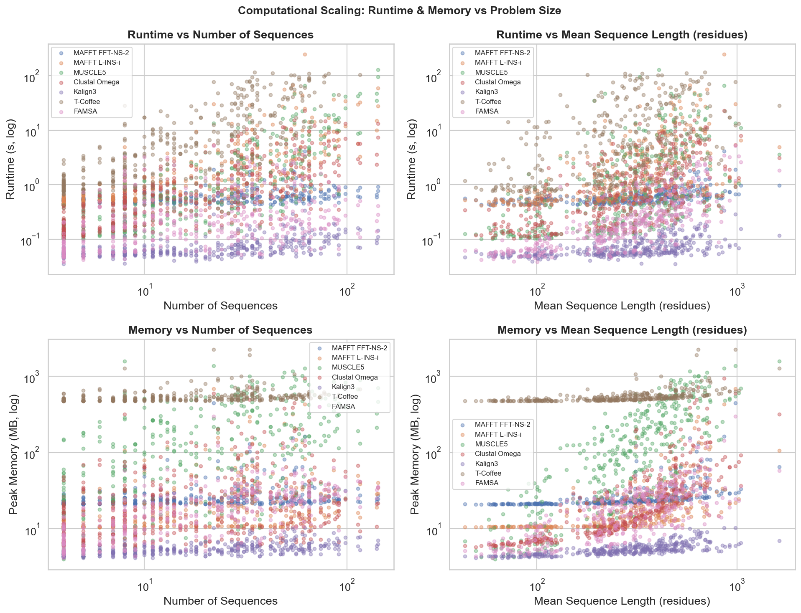
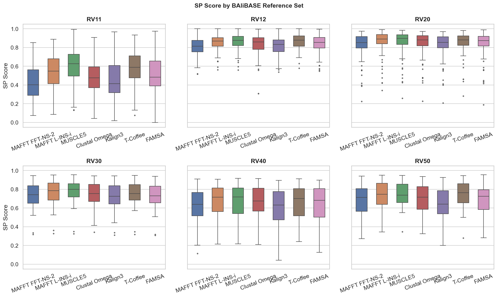

# Systematic Benchmarking of Multiple Sequence Alignment Algorithms


[](https://www.python.org/)
[](https://jupyter.org/)
[]()
[]()
[]()
[](https://creativecommons.org/licenses/by-sa/4.0/)

---

## What Is This?

**Multiple Sequence Alignment (MSA)** is the process of lining up three or more protein (or DNA) sequences so that equivalent positions are in the same column. It is the essential first step in:

- **Phylogenetics** — building evolutionary trees
- **Homology modelling** — predicting protein 3D structure from a known relative
- **Conserved domain detection** — finding functionally important regions across species
- **Variant effect prediction** — understanding mutations in context

The catch: MSA is NP-hard to solve optimally, so every tool uses heuristics. Different heuristics make different trade-offs between accuracy, speed, and memory — and until now, most practitioners choose a tool based on familiarity rather than evidence.

This project runs a rigorous, multi-dataset benchmark so you can make that choice with actual data.

---

## Overview

We benchmarked **7 widely-used MSA tools** across **2,885 protein families** from four independently curated structural benchmarks to give practitioners data-backed guidance on which aligner to use — and when.

Ground truth is defined by 3D crystal structure superposition (not sequence similarity), following the evaluation framework of [Santus et al. 2025](https://doi.org/10.1093/nargab/lqaf104) and the [nf-core/multiplesequencealign](https://github.com/nf-core/multiplesequencealign) pipeline. Alignments are scored with **SP (Sum-of-Pairs)** and **TC (Total Column)** metrics using structure-based residue masking.

---

## How We Score Alignments

Getting the ground truth right is the hardest part of any MSA benchmark. We use two complementary metrics, both computed only on **uppercase (structurally confirmed)** residue positions:

### Sum-of-Pairs (SP)
Counts the fraction of residue *pairs* that are correctly co-aligned — i.e., if residues A and B should be in the same column according to the reference structure, did the aligner put them there? SP gives partial credit per pair, making it sensitive to per-column accuracy.

### Total Column (TC)
A column scores 1 only if **every single residue** in that column matches the reference. One wrong residue zeroes the whole column. TC is strict — it rewards aligners that get entire conserved blocks exactly right.

> **Why structure-based?** Crystal structure superposition defines "correct alignment" by the physical geometry of the molecule — atoms that overlap in 3D space should be in the same column. This is the most objective possible ground truth, independent of sequence similarity.

---

## Key Findings

| Finding | Detail |
|---|---|
| **Friedman test** | χ² = 935.73, df = 6, p < 10⁻¹⁹⁹ — differences are not borderline |
| **Three performance tiers** | Confirmed by Nemenyi post-hoc at α = 0.05 |
| **Tier 1 — Top** | MUSCLE5 (SP = 0.761 ± 0.174) |
| **Tier 2 — Middle** | T-Coffee · MAFFT L-INS-i · Clustal Omega · FAMSA |
| **Tier 3 — Bottom** | MAFFT FFT-NS-2 · Kalign3 (statistically indistinguishable, p = 0.524) |
| **Identity threshold** | Above 60% identity all tools converge; below 20% the gap reaches ~0.15 SP units |
| **Pareto winners** | FAMSA (speed) and MUSCLE5 (accuracy) — no other tool dominates both |
| **Rankings generalise** | Three-tier structure reproduced on all four independent benchmarks |

---

## Critical Difference Diagram

<p align="center">
  
</p>

*Tools connected by a bar are statistically indistinguishable at α = 0.05. Average rank increases left to right (lower rank = better). MUSCLE5 is the sole top-tier tool. FFT-NS-2 and Kalign3 are statistically identical — choosing between them offers no accuracy benefit.*

---

## Accuracy Distributions & Pareto Frontier

<p align="center">
  
  
</p>

**Left — Score distributions:** Each box shows the spread of SP (and TC) scores across all 386 protein families. MUSCLE5 not only has the highest median but also the tightest distribution — it is consistently good, not just occasionally excellent.

**Right — Pareto frontier:** Plotting mean SP against log-median runtime reveals which tools offer the best value. A tool is *Pareto-optimal* if no other tool beats it on both accuracy and speed simultaneously. Only **FAMSA** and **MUSCLE5** sit on this frontier. Every other tool is dominated by at least one of them.

---

## Score vs. Sequence Identity

<p align="center">
  
</p>

This is the most actionable finding in the study. The x-axis shows mean pairwise sequence identity of each protein family; the y-axis shows SP score. Three key zones:

| Identity range | What happens | What to do |
|---|---|---|
| > 60% | All 7 tools converge within 0.05 SP units | Use Kalign3 or FAMSA — save compute |
| 20–60% | Moderate spread, tier structure visible | FAMSA is the best value |
| < 20% | Gap reaches ~0.15 SP units | Use MUSCLE5 or MAFFT L-INS-i |

A 0.15 SP gap means roughly **15 extra correctly aligned residue pairs per 100** — enough to flip a phylogenetic branch, or misplace a catalytic residue in a homology model.

---

## Runtime Scaling

<p align="center">
  
</p>

Each point is one protein family; trend lines are LOWESS smooths. This reveals which tools have algorithmic scalability problems:

- **FAMSA and Kalign3** — essentially flat across 5–150 sequences. Safe for genome-scale use.
- **MAFFT L-INS-i and MUSCLE5** — super-linear growth due to pairwise steps, but manageable.
- **T-Coffee** — exponential beyond ~30 sequences. The O(N²) pairwise library construction causes the 11% timeout rate on BAliBASE and makes it impractical for anything but small curated sets.
- **Clustal Omega** — appeared scalable in earlier versions, but failed on **78% of PREFAB4's 50-sequence families** due to a distance-matrix bottleneck.

---

## Per-Reference-Set Breakdown

<p align="center">
  
</p>

BAliBASE 3.0 is divided into six reference sets, each targeting a different evolutionary challenge:

| RV Set | Description | Key Observation |
|---|---|---|
| RV11 | Small families, < 25% identity | Hardest — largest inter-tool gap (0.17 SP). Where top-tier tools matter most |
| RV12 | Large families, < 25% identity | Rankings compressed; all tools struggle equally |
| RV20 | Families with long insertions / extensions | MUSCLE5 advantage holds |
| RV30 | Families containing internal repeats | Consistent tier separation |
| RV40 | Transmembrane proteins | All tools cluster within 0.05 SP — domain topology limits alignment quality |
| RV50 | Large, highly divergent families | MUSCLE5 maintains its lead; T-Coffee starts timing out |

---

## Tools Compared

| Tool | Algorithm Family | Core Idea | Runtime | SP Score |
|---|---|---|---|---|
| MAFFT FFT-NS-2 | Progressive | FFT-based distance, single pass | 0.55 s | 0.688 |
| MAFFT L-INS-i | Iterative refinement | Smith-Waterman pairwise, iterative realignment | 0.88 s | 0.743 |
| MUSCLE5 | Ensemble iterative | Generates multiple alignments from different seeds, keeps the best | 0.52 s | 0.761 |
| Clustal Omega | Progressive | HMM-guided alignment with seeded guide tree | 0.64 s | 0.718 |
| Kalign3 | Progressive | UPGMA guide tree with Wu-Manber string matching | 0.06 s | 0.692 |
| T-Coffee | Consistency-based | Builds a library of all pairwise alignments, uses co-occurrence frequencies | 5.30 s | 0.746 |
| FAMSA | Progressive | Column reuse in UPGMA tree — avoids redundant column insertion | 0.19 s | 0.718 |

> All tools pinned to **1 CPU thread** for fair algorithmic comparison. Runtime is median wall-clock time on BAliBASE 3.0.

---

## Datasets

| Dataset | Families | Ground Truth Source | Why It Was Chosen |
|---|---|---|---|
| [BAliBASE 3.0](https://www.lbgi.fr/balibase/) | 386 | 3D structure superposition + manual curation | Community gold standard; six distinct evolutionary regimes |
| [OXBench](https://www.compbio.dundee.ac.uk/www-oxbench/) | 395 | Crystal structure overlay only | Fully objective — no human judgment involved |
| [SABRE](https://www.ncbi.nlm.nih.gov/pmc/articles/PMC1478177/) | 423 | Structure-derived | Wide range of pairwise identities tests robustness |
| [PREFAB4](https://www.drive5.com/bench/) | 1,681 | Pairwise structural reference | ~50 seqs per family — the primary scalability stress test |

Using four independent datasets guards against overfitting conclusions to any single benchmark's biases.

---

## Results Summary — BAliBASE 3.0

| Aligner | SP mean ± SD | TC mean ± SD | Runtime (s) | Memory (MB) | Completed |
|---|---|---|---|---|---|
| **MUSCLE5** | **0.761 ± 0.174** | **0.399 ± 0.245** | 0.52 | 112.5 | 386 / 386 |
| T-Coffee† | 0.746 ± 0.182 | 0.394 ± 0.248 | 5.30 | 512.0 | 342 / 386 |
| MAFFT L-INS-i | 0.743 ± 0.188 | 0.379 ± 0.238 | 0.88 | 13.4 | 386 / 386 |
| Clustal Omega | 0.718 ± 0.201 | 0.363 ± 0.240 | 0.64 | 16.3 | 386 / 386 |
| FAMSA | 0.718 ± 0.199 | 0.357 ± 0.257 | 0.19 | 17.1 | 386 / 386 |
| Kalign3 | 0.692 ± 0.209 | 0.322 ± 0.245 | 0.06 | 5.3 | 385 / 386 |
| MAFFT FFT-NS-2 | 0.688 ± 0.205 | 0.315 ± 0.233 | 0.55 | 23.3 | 386 / 386 |

† T-Coffee timed out on 44/386 problems (> 200 s) on large-sequence reference sets.

---

## Cross-Dataset Generalisation

Rankings held across all four independent benchmarks, confirming they reflect real algorithmic properties — not BAliBASE-specific artefacts.

| Aligner | BAliBASE (n=386) | OXBench (n=395) | SABRE (n=423) | PREFAB4 |
|---|---|---|---|---|
| **MUSCLE5** | **0.761** | **0.898** | 0.600 | 0.690 (n=1,681) |
| T-Coffee | 0.746 | **0.898** | 0.597 | 0.680 (n=1,596) ‡ |
| MAFFT L-INS-i | 0.743 | 0.886 | 0.575 | **0.694** (n=1,681) |
| FAMSA | 0.718 | 0.896 | 0.565 | 0.659 (n=1,681) |
| Clustal Omega | 0.718 | 0.889 | 0.551 | 0.696 (n=369) † |
| MAFFT FFT-NS-2 | 0.688 | 0.882 | 0.537 | 0.650 (n=1,681) |
| Kalign3 | 0.692 | 0.886 | 0.522 | 0.617 (n=1,681) |

† Clustal Omega: 78% timeout on PREFAB4.  ‡ T-Coffee: 11% timeout on BAliBASE.

---

## Statistical Pipeline

Five tests were applied in sequence to ensure rigorous, reproducible comparisons. All non-parametric — SP/TC scores are bounded in [0, 1] and cannot be assumed normal.

```
1. Friedman Test
   Are there any global differences among the 7 tools?
   → χ² = 935.73, df = 6, p < 10⁻¹⁹⁹  (not a borderline result)
          ↓
2. Wilcoxon Signed-Rank Tests (pairwise)
   Which specific pairs of tools differ significantly?
   → 20 of 21 pairs significant. Only FFT-NS-2 vs Kalign3 (p = 0.524)
          ↓
3. Benjamini-Hochberg FDR Correction
   Control false discovery rate at 5% across all 21 pairwise tests
   → All 20 significant pairs remain significant after correction
          ↓
4. Cliff's δ Effect Sizes
   How large are the differences in practice?
   → All effects negligible–to–small (max |δ| = 0.22)
     Real and consistent, but moderate per individual family
          ↓
5. Nemenyi Post-hoc Test + Bootstrap 95% CIs
   Which groups of tools are statistically indistinguishable?
   → Three distinct tiers confirmed
     10,000 bootstrap resamples confirm tier stability across all RV sets
```

---

## Quick-Reference Guide

| Use Case | Best Tool | Why |
|---|---|---|
| Divergent sequences (< 20% identity) | **MUSCLE5** or MAFFT L-INS-i | ~0.15 SP advantage — changes phylogenetic outcomes |
| Genome-scale pipelines | **FAMSA** | Pareto-optimal: matches Clustal Omega accuracy at 3× lower runtime |
| Speed-only / very large families | **Kalign3** | 0.06 s median, near-flat scaling, acceptable accuracy |
| Small curated families, no time limit | **T-Coffee** | Consistency-based accuracy competitive with MUSCLE5 on small sets |
| High-identity sequences (> 60%) | Any — use **Kalign3** | All tools converge; there is no accuracy reason to use a slower tool |

---

## Repository Structure

```
.
├── 01_setup.ipynb          # Install WSL tools (MAFFT, MUSCLE5, Clustal Omega,
│                           #   Kalign3, T-Coffee, FAMSA), verify BAliBASE 3.0 data
│
├── 02_benchmark.ipynb      # Run all 7 aligners on BAliBASE 3.0
│                           #   Checkpoint-resumable — safe to kill and restart
│                           #   Output: results/results.csv
│
├── 03_analysis.ipynb       # Full statistical analysis pipeline:
│                           #   Friedman · Wilcoxon · BH correction · Cliff's δ
│                           #   Nemenyi post-hoc · Bootstrap CIs · 21 figures
│
├── run_bench_datasets.py   # Benchmark runner for OXBench, SABRE, PREFAB4
│                           #   Parallel workers, checkpointed, 1-thread per aligner
│
├── report.pdf              # Full 5-page report (OUP Contemporary format)
├── MSA_Benchmark_10slides.pptx  # 10-slide 15-min presentation
│
└── figures/                # 21 publication-quality figures (PNG)
    ├── fig1_accuracy_overall     — SP/TC distributions
    ├── fig2_sp_by_rvset          — Per-reference-set breakdown
    ├── fig4_pareto               — Accuracy-speed Pareto frontier
    ├── fig14_cd_diagram          — Critical difference diagram
    ├── fig16_scaling_plots       — Runtime vs sequence count
    ├── fig21_score_vs_identity   — SP score vs pairwise identity
    └── ...15 more
```

---

## Reproducing the Results

### Prerequisites

- Windows 10/11 with WSL2 (Ubuntu 22.04)
- Python 3.11+

```bash
pip install biopython tqdm pandas scipy matplotlib seaborn
```

- BAliBASE 3.0 data — [download here](https://www.lbgi.fr/balibase/), extract into `data/bb3_release/`

### Steps

```bash
# 1. Install bioinformatics tools in WSL
#    Open 01_setup.ipynb in VS Code and run all cells.
#    Installs MAFFT, MUSCLE5, Clustal Omega, Kalign3, T-Coffee, FAMSA via apt + binary downloads.

# 2. Run the BAliBASE 3.0 benchmark  (checkpoint-resumable — safe to interrupt)
#    Open 02_benchmark.ipynb and run all cells.
#    Output: results/results.csv

# 3. Run on additional datasets
python run_bench_datasets.py                  # all three: OXBench, SABRE, PREFAB4
python run_bench_datasets.py oxbench sabre   # subset
python run_bench_datasets.py --workers 4     # parallel problems (default: 4)

# 4. Statistical analysis and all 21 figures
#    Open 03_analysis.ipynb and run all cells.
#    Output: figures/*.png
```

---

## Methodology Reference

> Santus et al. (2025). *An nf-core framework for the systematic comparison of alternative modeling tools: the multiple sequence alignment case study.* NAR Genomics and Bioinformatics, 7(3), lqaf104. [doi:10.1093/nargab/lqaf104](https://doi.org/10.1093/nargab/lqaf104)

Pipeline: [github.com/nf-core/multiplesequencealign](https://github.com/nf-core/multiplesequencealign)

---

*Released under [CC BY-SA 4.0](https://creativecommons.org/licenses/by-sa/4.0/). Free to share and adapt with attribution.*
