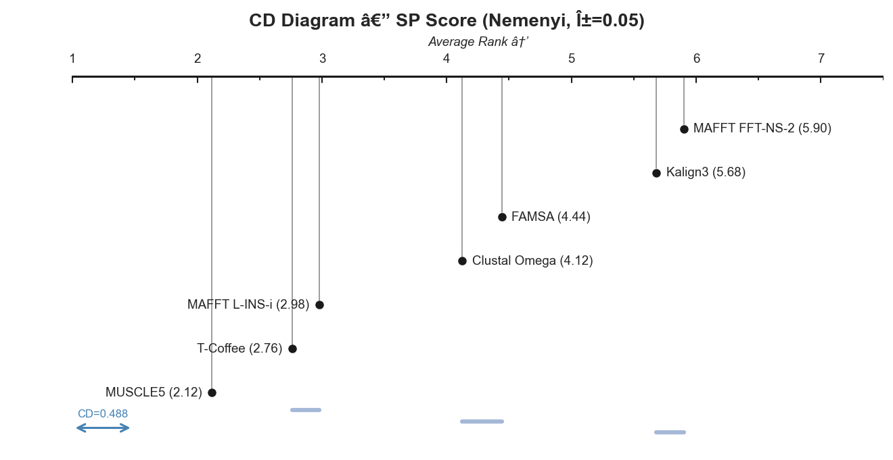
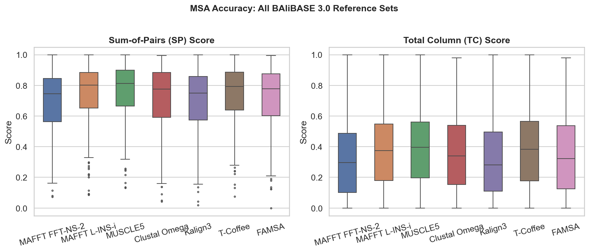
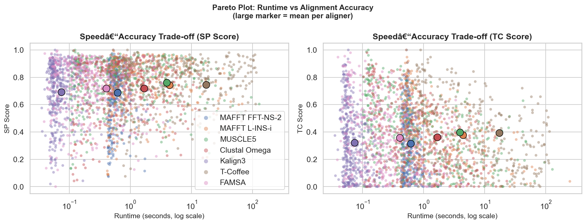
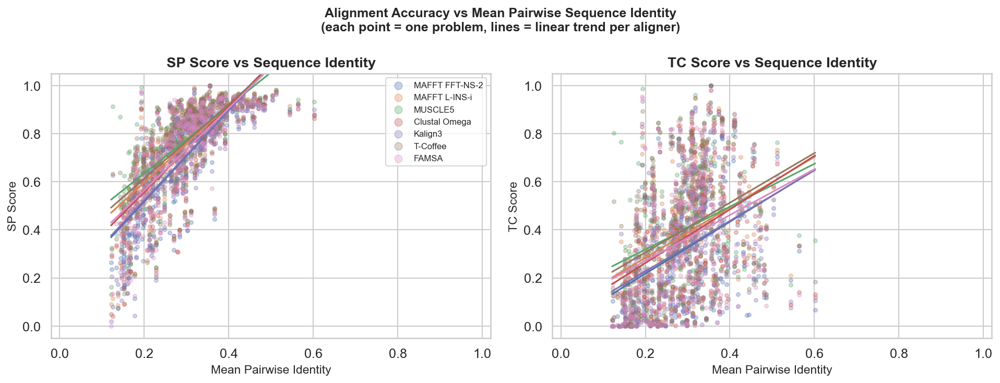

# Systematic Benchmarking of Multiple Sequence Alignment Algorithms

> **Computational Biology · University of Illinois at Chicago · Spring 2026**
> Anand Meena · Shruthi Kodati

[](https://www.python.org/)
[](https://www.latex-project.org/)
[]()
[]()
[](https://creativecommons.org/licenses/by-sa/4.0/)

---

## Overview

We benchmarked **7 widely-used MSA tools** across **2,885 protein families** from four independently curated structural benchmarks to give practitioners data-backed guidance on which aligner to use — and when.

Ground truth is defined by 3D crystal structure superposition (not sequence similarity), following the evaluation framework of [Santus et al. 2025 / nf-core/multiplesequencealign](https://github.com/nf-core/multiplesequencealign). Alignments are scored with **SP (Sum-of-Pairs)** and **TC (Total Column)** metrics using structure-based residue masking.

---

## Key Findings

| Finding | Detail |
|---|---|
| **Friedman test** | chi-squared = 935.73, df = 6, p < 10^-199 |
| **Three performance tiers** | Confirmed by Nemenyi post-hoc at alpha = 0.05 |
| **Tier 1 — Top** | MUSCLE5 (SP = 0.761 +/- 0.174) |
| **Tier 2 — Middle** | T-Coffee · MAFFT L-INS-i · Clustal Omega · FAMSA |
| **Tier 3 — Bottom** | MAFFT FFT-NS-2 · Kalign3 (indistinguishable, p = 0.524) |
| **Identity threshold** | Above 60% identity all tools converge; below 20% the gap reaches ~0.15 SP units |
| **Pareto winners** | FAMSA (speed) and MUSCLE5 (accuracy) |
| **Rankings generalise** | Three-tier structure reproduced on all four independent benchmarks |

---

## Critical Difference Diagram

<p align="center">
  
</p>

*Tools connected by a bar are statistically indistinguishable. MUSCLE5 is the sole top-tier tool.*

---

## Accuracy Distributions and Pareto Frontier

<p align="center">
  
  
</p>

---

## Score vs. Sequence Identity

<p align="center">
  
</p>

*The performance gap between tiers is largest below 20% identity — where alignment matters most biologically.*

---

## Tools Compared

| Tool | Algorithm Family | Key Characteristic |
|---|---|---|
| MAFFT FFT-NS-2 | Progressive | Fast single-pass, uses FFT |
| MAFFT L-INS-i | Iterative refinement | Smith-Waterman pairwise, O(N^2) |
| MUSCLE5 | Ensemble iterative | Multi-seed, selects best alignment |
| Clustal Omega | Progressive | HMM-guided, seeded guide tree |
| Kalign3 | Progressive | UPGMA, fastest of all |
| T-Coffee | Consistency-based | Pairwise library, highest accuracy cost |
| FAMSA | Progressive | Column reuse, best speed/accuracy ratio |

All tools pinned to **1 CPU thread** for fair runtime comparison.

---

## Datasets

| Dataset | Families | Ground Truth | Notes |
|---|---|---|---|
| [BAliBASE 3.0](https://www.lbgi.fr/balibase/) | 386 | 3D structure superposition | 6 reference sets, manually curated |
| [OXBench](https://www.compbio.dundee.ac.uk/www-oxbench/) | 395 | Crystal structure overlay | Objective — no human curation bias |
| [SABRE](https://www.ncbi.nlm.nih.gov/pmc/articles/PMC1478177/) | 423 | Structure-derived | Wide identity range |
| [PREFAB4](https://www.drive5.com/bench/) | 1,681 | Pairwise structure | ~50 seqs/family; scalability stress-test |

---

## Results Summary — BAliBASE 3.0

| Aligner | SP mean +/- SD | TC mean +/- SD | Runtime (s) | Memory (MB) | Completed |
|---|---|---|---|---|---|
| **MUSCLE5** | **0.761 +/- 0.174** | **0.399 +/- 0.245** | 0.52 | 112.5 | 386/386 |
| T-Coffee* | 0.746 +/- 0.182 | 0.394 +/- 0.248 | 5.30 | 512.0 | 342/386 |
| MAFFT L-INS-i | 0.743 +/- 0.188 | 0.379 +/- 0.238 | 0.88 | 13.4 | 386/386 |
| Clustal Omega | 0.718 +/- 0.201 | 0.363 +/- 0.240 | 0.64 | 16.3 | 386/386 |
| FAMSA | 0.718 +/- 0.199 | 0.357 +/- 0.257 | 0.19 | 17.1 | 386/386 |
| Kalign3 | 0.692 +/- 0.209 | 0.322 +/- 0.245 | 0.06 | 5.3 | 385/386 |
| MAFFT FFT-NS-2 | 0.688 +/- 0.205 | 0.315 +/- 0.233 | 0.55 | 23.3 | 386/386 |

\* T-Coffee timed out on 44/386 problems (> 200 s) on large-sequence reference sets.

---

## Quick-Reference Guide

| Use Case | Recommended Tool |
|---|---|
| Divergent sequences (< 20% identity) | **MUSCLE5** or MAFFT L-INS-i |
| Genome-scale pipelines | **FAMSA** |
| Speed-only / very large families | Kalign3 |
| Small curated families, no time limit | T-Coffee |

---

## Repository Structure

```
.
├── 01_setup.ipynb              # Install WSL tools, verify BAliBASE 3.0 data
├── 02_benchmark.ipynb          # Run all 7 aligners (checkpoint-resumable)
├── 03_analysis.ipynb           # Stats: Friedman, Wilcoxon, Nemenyi, all plots
│
├── report.pdf                  # Compiled 5-page report (OUP format)
│
├── figures/                    # 21 publication-quality figures (PNG)
│
├── run_bench_datasets.py       # Runs benchmark on OXBench, SABRE, PREFAB4
│
└── MSA_Benchmark_10slides.pptx # 10-slide 15-min presentation
```

---

## Reproducing the Results

### Prerequisites

- Windows 10/11 with WSL2 (Ubuntu 22.04)
- Python 3.11: `pip install biopython tqdm pandas scipy matplotlib seaborn`
- BAliBASE 3.0 data ([download from lbgi.fr](https://www.lbgi.fr/balibase/)) — extract into `data/bb3_release/`

### Step-by-step

```bash
# 1. Install bioinformatics tools in WSL
#    Open 01_setup.ipynb in VS Code and run all cells.
#    Installs: MAFFT, MUSCLE5, Clustal Omega, Kalign3, T-Coffee, FAMSA

# 2. Run the benchmark (safe to interrupt — results are checkpointed)
#    Open 02_benchmark.ipynb and run all cells.
#    Output: results/results.csv

# 3. Statistical analysis and figure generation
#    Open 03_analysis.ipynb and run all cells.
#    Output: figures/*.pdf  (21 figures)
```

---

## Methodology Reference

This benchmark follows the evaluation framework of:

> Santus et al. (2025). *An nf-core framework for the systematic comparison of alternative modeling tools: the multiple sequence alignment case study.* NAR Genomics and Bioinformatics, 7(3), lqaf104. [doi:10.1093/nargab/lqaf104](https://doi.org/10.1093/nargab/lqaf104)

Pipeline: [github.com/nf-core/multiplesequencealign](https://github.com/nf-core/multiplesequencealign)

---
